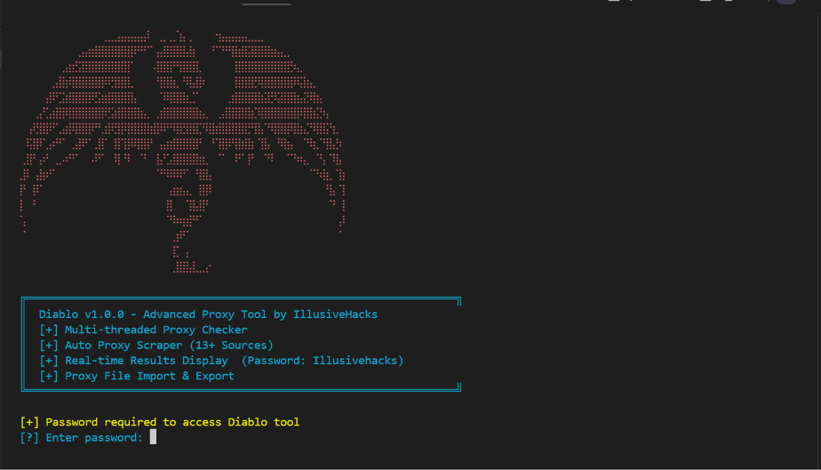
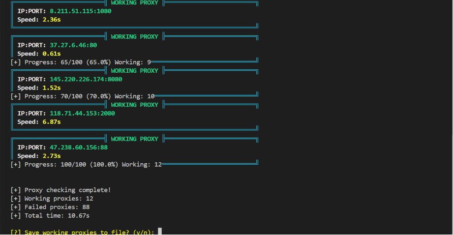
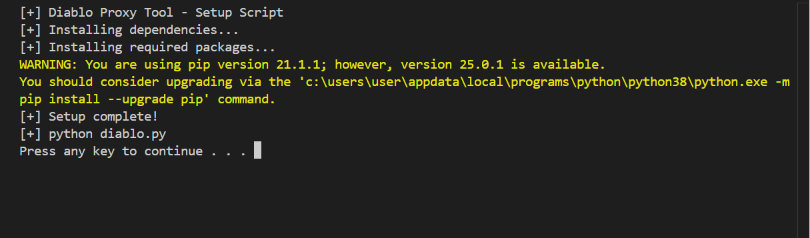

# Diablo - Advanced Proxy Tool by IllusiveHacks.

## Overview
Diablo is a powerful, multi-threaded proxy tool that combines proxy scraping, checking and management in one comprehensive solution. It features real-time results display, support for multiple proxy sources and both online and local proxy testing capabilities.



## Features
[+] Auto-fetch proxies from 13+ online sources
[+] Multi-threaded proxy checking (up to 50 concurrent threads)
[+] Real-time results display with color-coded output
[+] Support for both online and local proxy testing
[+] Speed measurement and sorting
[+] Export working proxies to file
[+] Beautiful ASCII banner and animated interface
[+] Password protection for security





## Installation

### Linux / macOS
```bash
chmod +x setup.sh
./setup.sh

** Windows 
setup.bat

** Manual installation
```bash
pip install -r requirements.txt
python diablo.py
